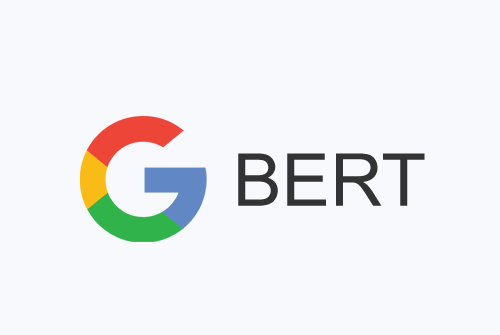

# Iniciación a Modelos de Lenguaje (LLM)

En este repositorio encontrarás material didáctico sobre los grandes modelos de lenguaje.

## ¿Por qué este repositorio?

La información sobre modelos de lenguaje puede ser difícil de encontrar y está dispersa en diferentes recursos. Aquí, nuestro objetivo es ofrecerte una guía clara y accesible sobre cómo funcionan estos modelos, los tipos que existen y de qué manera están construidos.

## Contenido del Repositorio

### Capítulo 1: Grandes Modelos de Lenguaje

#### Introducción

Los grandes modelos de lenguaje (LLM) son una categoría de modelos avanzados entrenados con enormes conjuntos de datos para comprender y generar lenguaje natural y otros tipos de contenido. Estos modelos se han vuelto mundialmente conocidos al llevar la IA generativa al centro de atención pública y empresarial.

##### Antecedentes

Antes de la llegada de los Transformers, los modelos de lenguaje basados en redes neuronales recurrentes (RNN) eran dominantes en tareas de procesamiento de lenguaje natural (NLP). Estos modelos tenían limitaciones significativas como problemas con el gradiente y la eficiencia en paralelización.

##### Transformers

Los Transformers introdujeron la arquitectura de atención, superando las limitaciones de las RNN al permitir la atención paralela y capturar relaciones a largo plazo de manera eficiente.

   

   

### Contribuciones

Este repositorio está abierto a contribuciones. Si tienes conocimientos adicionales, ejemplos prácticos o recursos útiles que quieras compartir, ¡no dudes en colaborar!
